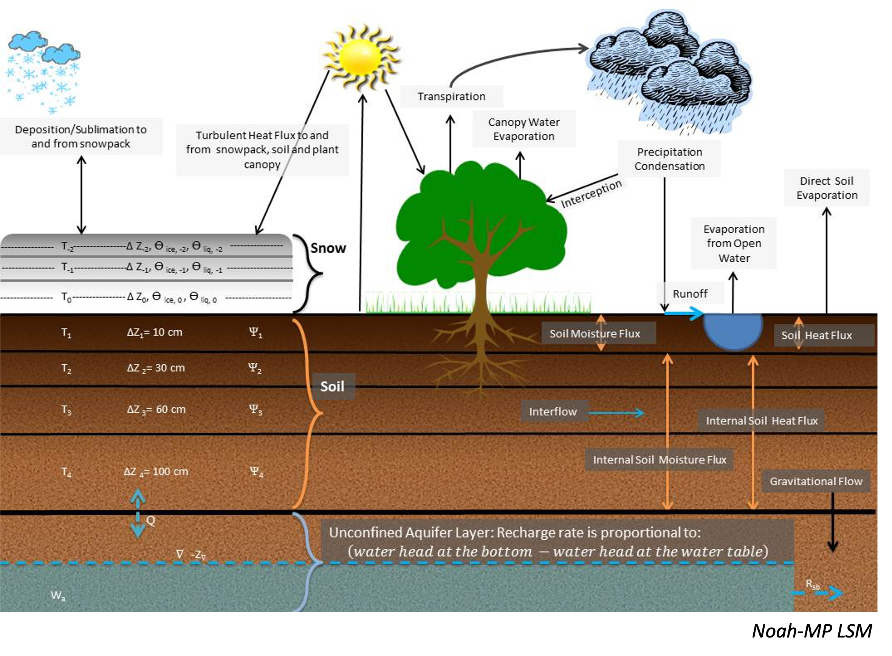
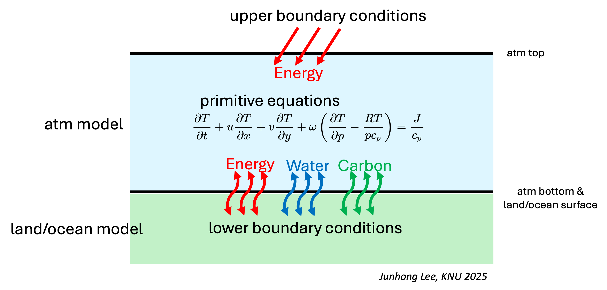
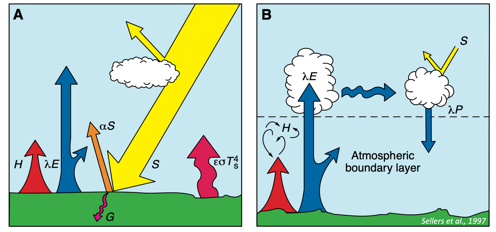
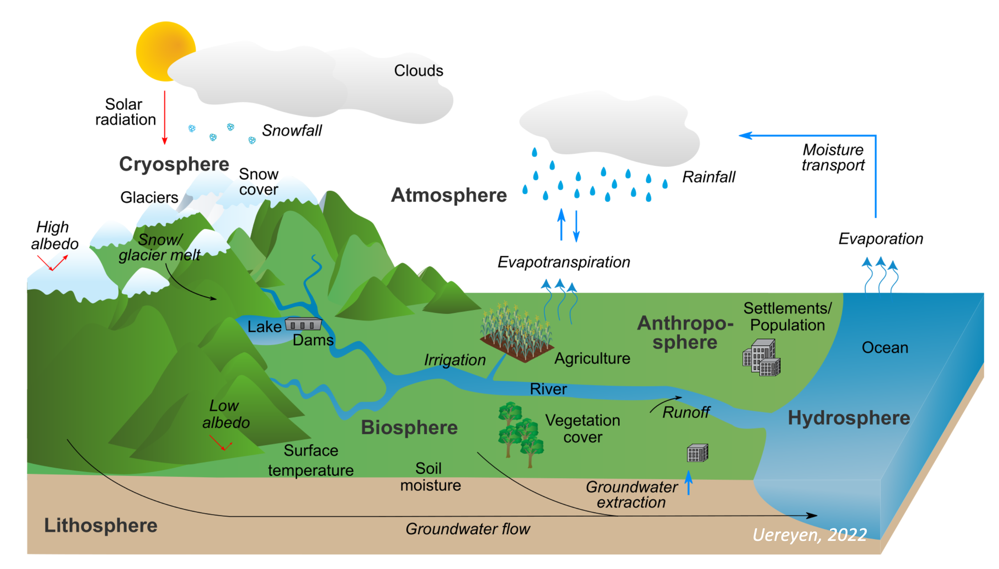
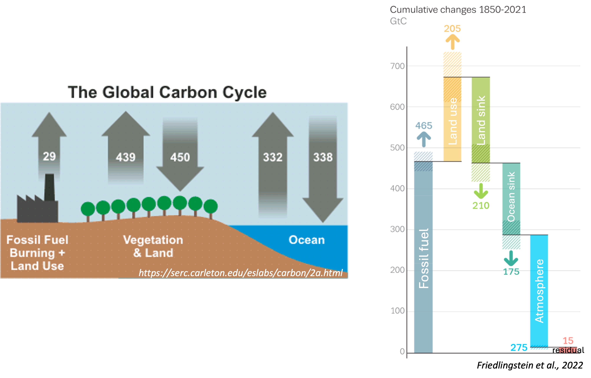

# Land surface model 개요

### 1.1. 정의

`````{admonition} Land Surface Model (LSM, 지면 모수화)
**The model represents interactions between land and atmosphere (Fig. 2).**
1) LSM computes energy/water/carbon fluxes & budgets between land and atmosphere.
2) LSM computes energy/water/carbon states in land.
`````

<figure>
  
  <figcaption>Figure 2. Example of Land Surface Model (LSM): Noah-MP LSM (https://www.jsg.utexas.edu/noah-mp/).</figcaption>
</figure>

<br>
<br>
<br>
<hr>


### 1.2 필요성
- Atmospheric model predicts atmospheric states using primitive equations.
<p style="margin: 0.8em 0;"></p>

- To solve primitive equations, initial & boundary conditions are required.
  - Initial condition includes temperature, wind, humidity fields \
    &#8594; provided as initial condition file at the beginning of integration.
<p style="margin: 0.8em 0;"></p>

  - Boundary condition includes temperature, wind, humidity fields at 1) upper boundary, 2) lower boundary. \
  1\) Upper boundary condition includes solar radiation from the space \
     &nbsp;&nbsp;&nbsp;&nbsp;&nbsp;&#8594; estimated by radiation scheme based on lat-lon, year, and day of the year. \
  2\) Lower boundary condition includes energy/water/carbon fluxes \
     &nbsp;&nbsp;&nbsp;&nbsp;&nbsp;&#8594; provided by land surface model/ocean model. 

<figure>
  
  <figcaption>Figure 3. Interaction between amtospheric model and LSM.</figcaption>
</figure>


<br>
<br>
<br>
<hr>


##### 1.2.1 Energy budget
**Land perspective**

- Energy in land is balanced between **1) the net amount of radiation ($R_n$)** and **2) three heat fluxes** 
(Fig. 4, {cite:p}`sellers1997modeling`).

<figure>
  
  <figcaption>Figure 4. Energy budget.</figcaption>
</figure>

`````{admonition} Net amount of radiation
$$
R_n = (1-\alpha) \cdot SW_d + LW_d - LW_u   \tag{1.1}
$$

where $\alpha$ is the surface albedo, $SW_d$ is downward solar radiation *at the surface*, $LW_d$ downward longwave radiation *at the surface*, $LW_u$ upward longwave radiation *at the surface*.
`````

`````{admonition} Three heat fluxes
1) sensitble heat flux ($H$), 
1) latent heat flux ($\lambda E$),
1) ground heat flux ($G$).

$$
C_{soil} \frac{\partial T_{s}}{\partial t} = (1-\alpha) \cdot SW_d + LW_d - LW_u - H - \lambda E - G    \tag{1.2}
$$

where $C_{soil}$ is the area-specific heat capacity of the uppermost soil layer [J/m<sup>2</sup>/K<sup>1</sup>]
`````


- Generally, if $R_n > H + \lambda E + G$ &#8594; land surface warming.

- The land surface:
  1) **gains** energy through $SW_d$ and $LW_d$ from the atmosphere.
  1) **looses** energy through $H$, $\lambda E$ and $\epsilon \sigma T_s^4$ to the atmosphere.

<mark>**$\therefore$ The atmosphere acts as a upper boundary condition.**</mark>

<br>
<br>

**Atmosphere perspective**

- The atmosphere:
  1) **looses** energy through $LW_d$ to the land surface.
  1) **gains** energy through $H$, $\lambda E$, and $\epsilon \sigma T_s^4$ from the land surface.
  
<mark>**$\therefore$ The land surface acts as a lower boundary condition.**</mark>


<br>
<br>
<br>
<hr>


##### 1.2.2 Water budget
**Land perspective**

- Water in land is balanced between **1) gain from the atmosphere** and **2) loss to the atmosphere and ocean** (Fig. 5, {cite:p}`ureyen2022multivariate`).
1) **gains** water through precipitation from the atmosphere.
1) **looses** water through evapotranspiration, runoff, and drainage (groundwater flow) to the atmosphere and *ocean*.

<mark>**$\therefore$ The atmosphere acts as a upper boundary condition.**</mark>


<figure>
  
  <figcaption>Figure 5. Water budget.</figcaption>
</figure>


**Atmosphere perspective**

- Water in the atmosphere is balanced betwee **1) gain from the land and ocean** and **2) loss to the land and ocean**
1) **looses** water through precipitation to land and ocean.
1) **gain** water through evapotranspiration from the land and ocean.

<mark>**$\therefore$ The land surface acts as a lower boundary condition.**</mark>

<br>
<br>
<br>
<hr>

##### 1.2.3 Carbon budget
- Similarly, balance between **carbon absorption** and **carbon emission/release** (Fig. 5, {cite:p}`friedlingstein2022global`).
- But, carbon budget will not be discussed in this lecture.

<figure>
  
  <figcaption>Figure 6. Carbon budget.</figcaption>
</figure>