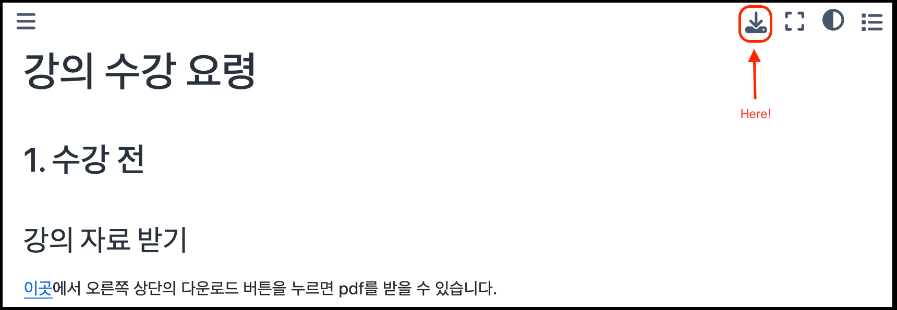

# 강의 수강 요령

## 1. 수강 전
### 강의 자료 받기
[이곳][git_page]에서 오른쪽 상단의 다운로드 버튼을 누르면 pdf를 받을 수 있습니다(Fig. 1).
<!-- git page 링크 수정 필요 -->

<figure>
  
  <figcaption>Figure 1. PDF 강의자료 다운 방법</figcaption>
</figure>


### 강의에 필요한 프로그램 설치
수강 중에 직접 toy model을 돌려보고 싶은 분들은 다음과 같은 프로그램들을 미리 설치해오시면 좋습니다.

- `git`<sup><a href="#footnote-1">*</a></sup>: https://git-scm.com/book/ko/v2/시작하기-Git-설치
- `anaconda`<sup><a href="#footnote-1">*</a></sup>: https://www.anaconda.com/download
- 코드 편집 툴 (e.g., vim, VSCODE 등)

<a name="footnote-1">*</a> Mac 사용자는 `brew`(https://brew.sh)를 통하여 `git`과 `ANACONDA`를 설치할 수 있습니다.


## 2. 수강 중
### 강의 jupyter notebook 사용하여 toy model 수행하기

1. jupyter notebook 파일 받기
```
git clone git@github.com:junhonglee89/KNU_2025_summer_school_LSM.git
```

2. anaconda environment 설치
```
cd ./KNU_2025_summer_school_LSM
conda env create --file environment.yml
conda activate KNU_2025_summer_school
```

3. jupyter notebook 실행
```
jupyter notebook
```
웹 브라우저가 띄워진 후, 원하는 jupyter notebook 파일 실행.


## 3. 수강 후
- `2. 수강 중` 과정을 통하여 받은  jupyter notebook 파일들을 따라서 toy model 만들어보기
<!-- 과제가 있다면 여기에 설명-->


[git_page]: https://scholar.google.com/citations?user=CfzQ610AAAAJ&hl=en